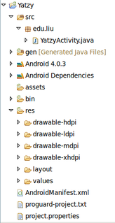

# Android Programming Workshop

Christopher League  
17 April 2012  
LIU Brooklyn

<https://github.com/league/liu-android/>

# The tools

I'm using **Eclipse IDE** Android Development:
<http://www.eclipse.org/downloads/> There are other good choices, such
as the IntelliJ IDEA by JetBRAINS — their Community Edition is free:
<http://www.jetbrains.com/idea/download/>

You can find complete directions for setting up Eclipse and the
Android SDK at: <http://developer.android.com/sdk/installing.html>

# Hello, World

Once Eclipse and the ADT are set up correctly, you can ask them to
generate a working sample project to get you started.

From the menu, select **File > New > Other…** and choose **Android
Project** from the wizard.

Hit **Next** and give your project a name, preferably starting with a
capital letter. I chose `Yatzy`. On the **next** screen, choose the
Android platform versions you're building for, then (**next** screen)
you have to provide the package name. This is usually a reversed
domain name, such as `edu.liu`. For now, it doesn't really matter.

When you **finish,** you should have an open project in the left pane.
Go into `src/edu.liu` and open `YatzyActivity.java`.

Select **Run > Run** from the menu, and choose **Android
Application.** The Android emulator should open up. It will take a
long time to boot the first time, but eventually you should see your
application: "Hello World, YatzyActivity!"

# Programmatic view

The given "hello world" code uses an XML document for the main view:
`R.layout.main`. You can find the details in `res/layout/main.xml`,
but instead we'll generate the view programmatically.

After `super.onCreate`, replace the `setContentView` line with this
code:

~~~~ {.java}
        LinearLayout main = new LinearLayout(this);
        main.setOrientation(LinearLayout.VERTICAL);
        TextView tv = new TextView(this);
        tv.setText("Hello, world.");
        main.addView(tv);
        setContentView(main);
~~~~

You'll also need to add these imports at the top. (Eclipse can do this
for you if you click on the error indicator in the left margin.)

~~~~ {.java}
import android.widget.LinearLayout;
import android.widget.TextView;
~~~~

You can run this version again, and see your message appear.  

[Code up to here is available as git commit `5d5af056`.]

# Images

In your project, create a sub-folder under `res` called `drawable`.
(There are already other folders called `drawable-hdpi`, etc.)

Copy the twelve image files from
<https://github.com/league/liu-android/tree/master/Yatzy/res/drawable>
and save them to your new `drawable` folder. They represent the six
dice, both in color and gray-scale. Now you can refer to them in your
code using `R.drawable.die1`, for example:

~~~~ {.java}
        ImageView d = new ImageView(this);
        d.setImageResource(R.drawable.die1);
        main.addView(d);
~~~~

Add the above code before you create the `TextView`. You'll need to
import `android.widget.ImageView`. Run it and you should see the die
containing 1 dot above the text message.

Let's put all six dice. We'll need an array to access the different
names `die1`, `die2`, … programmatically. Put these array
definitions within class `YatzyActivity` but outside of the method
`onCreate`:

~~~~ {.java}
    static int[] onDice = new int[] {
    	R.drawable.die1, R.drawable.die2, R.drawable.die3,
    	R.drawable.die4, R.drawable.die5, R.drawable.die6,
    };
    static int[] offDice = new int[] {
    	R.drawable.die1off, R.drawable.die2off, R.drawable.die3off,
    	R.drawable.die4off, R.drawable.die5off, R.drawable.die6off,
    };
~~~~

Then, swap out your `ImageView` code with this loop.

~~~~ {.java}
        LinearLayout diceRow = new LinearLayout(this);
        for(int i = 0; i < onDice.length; i++) {
        	ImageView im = new ImageView(this);
        	im.setImageResource(onDice[i]);
        	diceRow.addView(im);
        }
        main.addView(diceRow);
~~~~

Run it and you'll see all six dice appear across one row.

[Code up to here is available as git commit `80d5119e`.]

# Click

Now, we'll want to be able to click on those dice to enable or disable
them for the next roll. To do that, let's make `Die` a nested subclass
of `ImageView`:

~~~~ {.java}
    class Die extends ImageView {
		int value;
    	boolean on;
    	public Die(Context context, int value) {
			super(context);
			this.value = value;
			this.on = false;
			setResource();
		}
    	void setResource() {
    		if(on) {
    			setImageResource(onDice[value]);
    		}
    		else {
    			setImageResource(offDice[value]);
    		}
    	}
    }
~~~~

Then, create a couple of *global* variables in the `YatzyActivity`
class:

~~~~ {.java}
	final int NUM_DICE = 5;
	Die[] dice = new Die[NUM_DICE];
~~~~

And rewrite your `onCreate` loop to use the `Die` class instead of
creating `ImageView`s directly:

~~~~ {.java}
        LinearLayout diceRow = new LinearLayout(this);
        for(int i = 0; i < NUM_DICE; i++) {
        	dice[i] = new Die(this, i);
        	diceRow.addView(dice[i]);
        }
        main.addView(diceRow);
~~~~

The result should be the same, except that the 6-die is missing
because `NUM_DICE` is set to 5.

The dice are still not clickable though. For that, we need to arrange
for `Die` objects to be *listeners.* Add this one method call after
`super(context)` in the `Die` constructor:

~~~~ {.java}
			setOnClickListener(this);
~~~~

It will generate an error message at first. We need to modify the
declaration of the `Die` class as so:

~~~~ {.java}
    class Die extends ImageView implements View.OnClickListener
~~~~

Now *that* line indicates an error, because we have to add the
`onClick` method. Click on the error indicator, and Eclipse can
generate the stub of this method for you:

~~~~ {.java}
		@Override
		public void onClick(View v) {
			// TODO Auto-generated method stub
		}
~~~~

Replace the `TODO` comment with these two lines, to toggle the `on`
Boolean and then reset the image resource:

~~~~ {.java}
			this.on = !this.on;
			setResource();
~~~~

Now when you run, you should be able to toggle the dice between
gray-scale and red by clicking on them.

[Code up to here is available as git commit `d059dbae`.]

# Roll the dice

Now we need to select the values of the dice randomly. Add the
following variables to class `YatzyActivity`:

~~~~ {.java}
	Random rng = new Random();
	Button roll;
~~~~

(These are imported from `java.util.Random` and
`android.widget.Button`, respectively.) In `onCreate`, after adding
the `diceRow`, set up the new button:

~~~~ {.java}
        roll = new Button(this);
        roll.setText("Roll");
        roll.setOnClickListener(new View.OnClickListener() {
			@Override
			public void onClick(View v) {
				rollDice();
			}
		});
        main.addView(roll);
~~~~

We gave it an *inline* click listener, which will call the method
`rollDice()` when the roll button is clicked. That method is defined
in `YatzyActivity`, outside of any other method:

~~~~ {.java}
	void rollDice() {
		for(int i = 0; i < NUM_DICE; i++) {
			if(!dice[i].on) {
				dice[i].value = rng.nextInt(6);
				dice[i].setResource();
			}
		}
	}
~~~~

It will loop through all the dice, and pick a random number for each
one that is **not** `on`. (The dice that are `on` are colored red, and
that means the user is keeping their values through the next roll.)

**Note:** there is something slightly strange going on that we didn't
  point out until now. We are actually using the integers zero through
  five to represent values on the dice. `rng.nextInt(6)` produces a
  random value between 0 and 5 inclusive, and this is later used as an
  index of the `onDice` or `offDice` arrays. Of course, array indices
  start with zero, so it works out well. The only problem will happen
  when we try to *compute scores* — then we'll have to add one to
  these values to get an integer from 0 to 6 inclusive.

[Code up to here is available as git commit `97a983fe`.]
